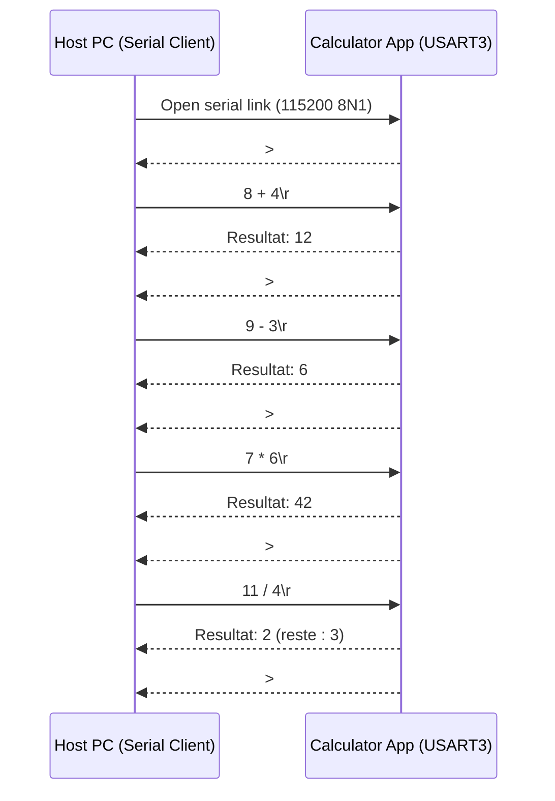

# Serial Calculator Sample Project

## What this project does

This repository is a Camelot-OS sample project that builds a firmware containing:

- the Sentry kernel
- the Shield runtime
- one userspace application named `calculator`

The calculator application exposes a serial console on USART3 and evaluates arithmetic expressions sent from a host PC.

### Calculator exchange flow



Main calculator features:

- prompt-based UART console (`> `)
- expression parsing with operator precedence
- support for `+`, `-`, `*`, `/`, and parentheses
- unsigned 32-bit integer arithmetic with overflow checks
- integer division with remainder reporting

USART settings for the calculator console:

- peripheral: USART3
- pins: PC10 (TX), PC11 (RX)
- mode: 115200 8N1

This configuration matches the nucleo-U5A5 configuration. If needed, the `dts/sample.dts` file can be updated to support another pinout configuration.

Expression behavior:

- spaces are ignored
- only unsigned integer literals are accepted
- invalid syntax, overflow, division by zero, or negative subtraction results are rejected
- successful output:
	- `Resultat: <value>`
	- `Resultat: <value> (reste : <remainder>)` for divisions
- error output: `Erreur`

Note: output strings are currently in French because they come from the calculator application source.

## Basics

This is a sample Camelot-OS project showing how to produce a complete firmware from a project definition.

A Camelot-OS project is organized around three core inputs:

- `configs/`: Kconfig-based configuration files used by each project component
- `dts/`: device tree sources describing hardware and memory mapping
- `project.toml`: project-wide metadata and software component declarations

The project declares three component types:

- a kernel (Sentry)
- a runtime (Shield)
- one or more applications (here: `calculator`)

Kernel and runtime are built first. Applications are then built with dependency-aware orchestration.

## Quick start

### Install Barbican

Barbican is the Camelot-OS project manager used to download components and generate the global build system.

```console
pip install --user camelot-barbican
```

### Set your cross-complilation configuration file

In order to properly build the project, you need the following:

- A working Rust cross-toolchain for armv8m target, in stable (e.g. 1.86) version, including cargo-index, cargo-clippy and cargo-fmt
- A working gcc cross-toolchain for armv8m, from ARM or from GNU directly
- A working native C/C++ toolchain for local kernel tooling

Once installed, set a meson cross-file that specify where your toolchains are.
As an example, you can take a look at the following repository https://github.com/camelot-os/meson-cross-files that delivers typical armv7-m and armv8-m cross-files. Set the cross-file paths accordingly to your local installation.

Once done, set the `crossfile` field to target your cross-file path.

If you prefer to use a container based build, you can use the `camelot-builder` image from https://github.com/camelot-os/camelot-builder/pkgs/container/camelot-builder

### Build the project

From the project root:

```console
barbican download
barbican setup
ninja -C output/build
```

This generates the full firmware build and all component artifacts under `output/build`.

### Deploy firmware (example workflow)

One common workflow with an STM32 board is:

```console
pip install pyocd
pyocd pack update
pyocd pack install stm32u5a5zjtxq
pyocd gdbserver
```

Then in another terminal:

```console
gdb-multiarch
```

Inside GDB:

```gdb
set arch arm
target remote localhost:3333
monitor reset halt
exec-file output/build/firmware.hex
load
continue
```

After boot, open the calculator serial console with `115200 8N1` on the board serial port.
In usual installation, there are two serial devices (based on GNU/Linux naming):

- `/dev/ttyACM0` : Senty kernel logs
- `/dev/ttyUSB0` : calculator prompt

Example session:

```text
> (8 + 4) / 3
Resultat: 4 (reste : 0)
> 6*7
Resultat: 42
> 1-2
Erreur
```

## About project configuration

The `project.toml` file describes all inputs required to build the firmware for a specific target.

It contains:

- a project header (metadata and global settings)
- one declaration block for each software component

### Camelot-OS project-wide information

| Field | Value type | Description |
| --- | --- | --- |
| `name` | String | Project name |
| `license` | SPDX identifier | Project license |
| `license_file` | File path array | Path(s) to license file(s) |
| `dts` | File path | Project device tree file |
| `crossfile` | File path | Meson cross compilation file |
| `version` | String | Project version |

Current project header:

```toml
name = 'Serial calculator demo Project'
license = 'Apache-2.0'
license_file = ['LICENSE.txt']
dts = 'dts/sample.dts'
crossfile = 'cm33-none-eabi-gcc.ini'
version = 'v0.0.1'
```

### Kernel declaration

The kernel block uses `[kernel]` with:

- `scm.git.uri`
- `scm.git.revision`
- `config`

Current kernel declaration:

```toml
[kernel]
scm.git.uri = 'https://github.com/camelot-os/sentry-kernel.git'
scm.git.revision = 'main'
config = 'configs/sentry.config'
```

### Runtime declaration

The runtime block uses `[runtime]` and the same fields as kernel:

- `scm.git.uri`
- `scm.git.revision`
- `config`

Current runtime declaration:

```toml
[runtime]
scm.git.uri = 'https://github.com/camelot-os/shield.git'
scm.git.revision = 'main'
config = 'configs/shield.config'
```

### Application declaration

Applications are declared with `[application.<name>]`.

Common fields:

- `scm.git.uri`
- `scm.git.revision`
- `config`
- `build.backend`
- `depends`
- `provides`

Current calculator declaration:

```toml
[application.calculator]
scm.git.uri = 'https://github.com/camelot-os-examples/app-calculator.git'
scm.git.revision = 'main'
config = 'configs/calculator.config'
build.backend = 'meson'
depends = []
provides = ['calculator-app.elf']
```

## Output directory hierarchy

Barbican uses `output/` to store generated and downloaded content.

Key directories:

- `output/src`: checked out component sources (kernel, runtime, applications)
- `output/build`: generated build files and compiled artifacts
- `output/staging`: staged install artifacts used by dependent components

Important flow:

- `barbican download` populates component sources under `output/src`
- `barbican setup` generates the top-level Ninja build graph in `output/build/build.ninja`
- `ninja -C output/build` builds all components in dependency order

The final firmware image (`firmware.hex`) and component binaries are produced under `output/build` and component-specific subdirectories.

## Debugging through Gdb

In order to allow firmware debug, relocalized ELF files are stored in the `output/build/camelot_private` directory. You can load one or more ELF file(s) and use Gdb as usual with
symbols resolved.
